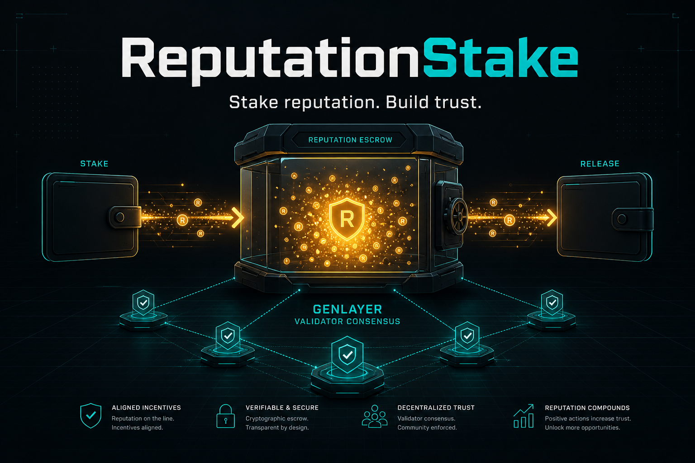

# ReputationStakeCore

<p align="center">
  
</p>

<p align="center">
  <strong>The ReputationStake intelligent contract on its own: escrowed reputation stakes that can only be slashed when validators agree, from frozen web evidence, that the obligation was breached.</strong>
</p>

<p align="center">
  <a href="https://github.com/valentinzubok/ReputationStakeCore/actions/workflows/ci.yml"></a>
  
  <a href="LICENSE"></a>
</p>

---

## The primitive

Someone promises something off-chain. You want them to have skin in the game, but you do not want the
counterparty — or you — to be judge and jury. ReputationStake escrows the stake and puts the breach question
under consensus:

```
credit_reputation(user, amount)        owner bootstraps bookkeeping units
stake(amount, target, purpose)         staker locks units against a named obligation
release(stake_id)                      target (or owner) releases: obligation met, units return
slash(stake_id, reason, evidence_url)  arbiter asks the network, it does not decide alone:
      1. validators fetch evidence_url and agree on its SHA-256 + text (eq_principle.strict_eq)
      2. validators' LLMs read the FROZEN evidence against `purpose` and `reason`
         and agree on one boolean `breach` (prompt_comparative)
      3. breach == true  → escrow moves to the target, stake marked slashed,
                            evidence_url and evidence_hash stored with the verdict
         breach == false → the whole transaction aborts: "validators did not find breach"
```

The last line is the point: an arbiter cannot slash on assertion alone. A slash needs evidence that the
network, reading it independently, agrees supports the claim.

### Design decisions worth reviewing

| Decision | Why |
|---|---|
| Only `breach` goes through `prompt_comparative` | A boolean converges across models; summaries do not. |
| Evidence is frozen first under `strict_eq` | The verdict is tied to the exact text validators saw, and the hash stays on chain. |
| A rejected slash reverts the whole call | No partial state, no "attempted slash" bookkeeping, and the escrow stays put. |
| Stake, release and slash are separate roles | Staker locks, target or owner releases, only the arbiter can ask for a slash. |
| Bookkeeping units, not native transfers | Studio-safe and auditable; the same logic maps onto a token later. |

## API

| Function | Access | Effect |
|---|---|---|
| `credit_reputation(user, amount)` | owner | Bootstrap balances. |
| `stake(amount, target, purpose)` | anyone with balance | Escrow units against an obligation (cannot stake to yourself). |
| `release(stake_id)` | target or owner | Obligation met: units go back to the staker. |
| `slash(stake_id, reason, evidence_url)` | arbiter or owner | Consensus-gated slash, as above. |
| `set_arbiter` · `set_fee` · `transfer_ownership` | owner | Wiring. |
| `get_stake` · `list_ids` · `list_by_status` · `get_balance` · `get_events` · `get_stats` · `get_owner` · `get_arbiter` · `get_fee` | view | Read state. |

## Live deployment (verified by CI)

| | |
|---|---|
| Network | GenLayer Studio Dev / Studio Next, chain `61997` |
| Contract | [`0x795b7661E10dF78BEd921dB7986C05b115614015`](https://explorer-studio-dev.genlayer.com/address/0x795b7661E10dF78BEd921dB7986C05b115614015) |
| Source sha256 | `8945223c774a1837942948ceecb625f8ded16b478585d1eb8732d14c112bf858` |
| Full record | [`STUDIO_DEV_DEPLOY.md`](STUDIO_DEV_DEPLOY.md) |

`scripts/verify_deployment.py` compares the deployed bytes with `contracts/ReputationStake.py` on every CI run,
so the repository cannot drift away from the contract a reviewer inspects.

## Tests

```bash
python3 -m pip install -r requirements-dev.txt
python3 -m pytest -q     # 13 tests
```

The suite substitutes a fake GenVM module and covers the lifecycle, access control, validation and both slash
outcomes.

## Using it from an app

Contract-only by design. The reference console (Next.js + `genlayer-js` + MetaMask) lives in
**[ReputationStake](https://github.com/valentinzubok/ReputationStake)**.

## License

[MIT](LICENSE) © 2026 Valentyn Zubok
